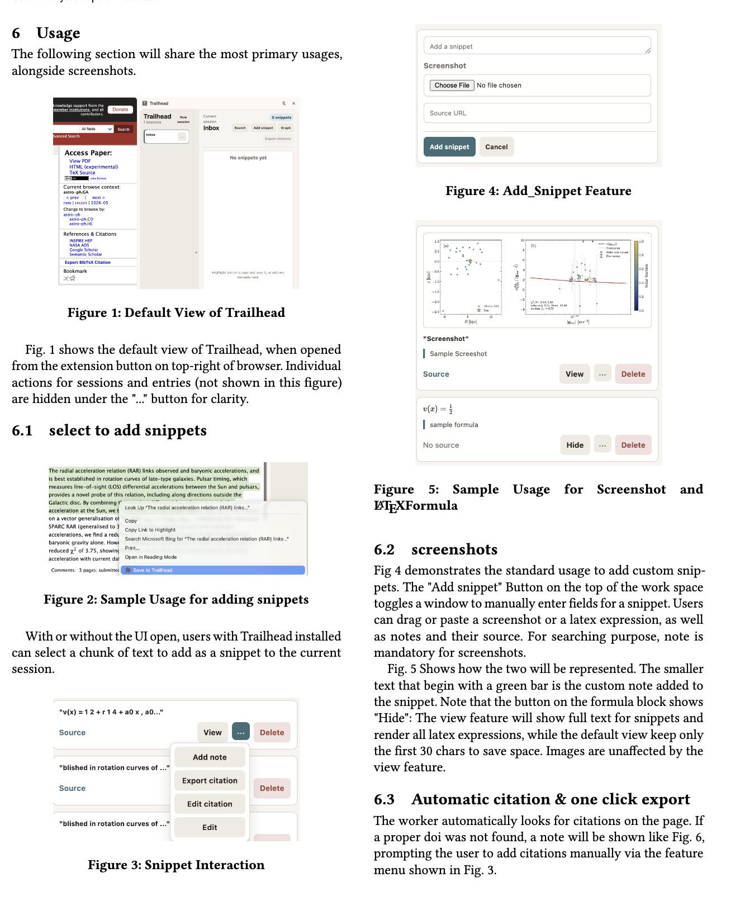

# Trailhead Extension

Chrome side panel extension for saving research snippets into sessions, adding notes and citations, and exporting BibTeX citations.


## Core Features


[Trailhead](https://github.com/reg223/trailhead) is designed to bridge the gap between passive citation management and active discovery. Below are the core capabilities that facilitate a "local-first" research workflow.

---

### Seamless Snippet Capture

* **Context Menu Integration:** Select arbitrary chunks of text from any webpage and instantly "blaze a trail" without leaving your current tab.
* **Lightweight UI:** Utilize the [Chrome SidePanel](https://chromewebstore.google.com/detail/trailhead/hnjccijmkciabhodgfdnkeadijbehgef) for a persistent, non-intrusive research companion that stays with you across different sources.
* **Rich Annotations:** Add personal notes to every snippet to preserve your mental context at the moment of discovery.

### Screenshot & Media Support

* **Visual Preservation:** Capture graphs, tables, and complex diagrams that cannot be easily converted to text.
* **Image-to-Note Association:** Force-associates mandatory notes with screenshots to ensure they remain searchable within your local index.

### STEM-First Workflow

* **Automatic Citation Fetching:** Trailhead automatically attempts to resolve DOI numbers from the active tab during snippet creation.
* **LaTeX Rendering:** Built-in support for rendering **100%** of your $\LaTeX$ formulas in the workspace view, making it ideal for math-heavy research.
* **One-Click BibTeX Export:** Export a de-duplicated list of all citations in a session with a single click, ready for your bibliography.

###  Local Associative Search

* **Parse-on-Insertion:** Every snippet is processed asynchronously upon capture via a background NLP worker ([Compromise.js](https://github.com/spencermountain/compromise)).
* **Concept-Based Retrieval:** Search your sessions using an index that prioritizes user notes and extracted keywords over simple full-text scans.

###  Visual Mental Map (Graph View)

* **Relational Discovery:** Visualize the connection between snippets through an interactive graph view.
* **Similarity Analysis:** Edges between nodes represent the **cosine similarity** between different data points, helping you identify subtopics and overlapping concepts in your research.


## Usage



## Commands

For those looking to patch/build upon it, run
```sh
npm run check
npm run build
```

to get a working distribution.

Load the built extension from `dist/` in Chrome.
